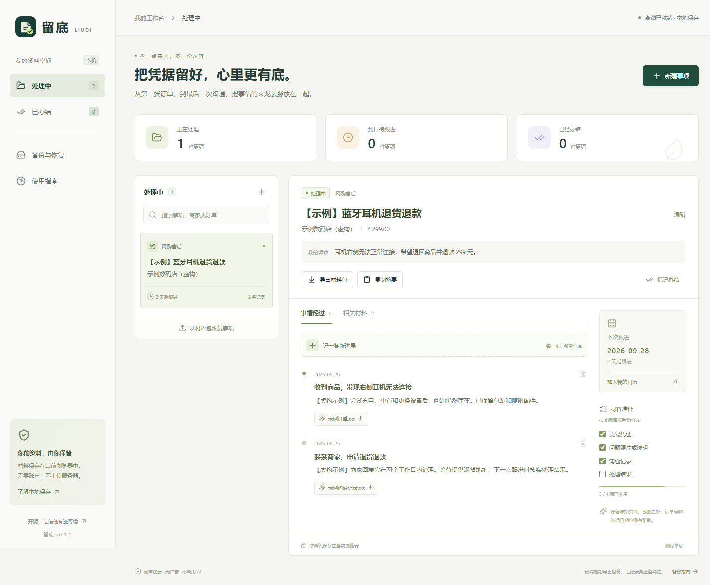
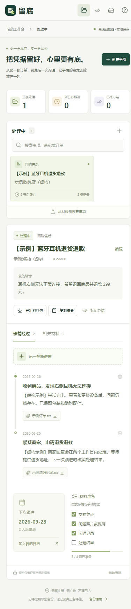
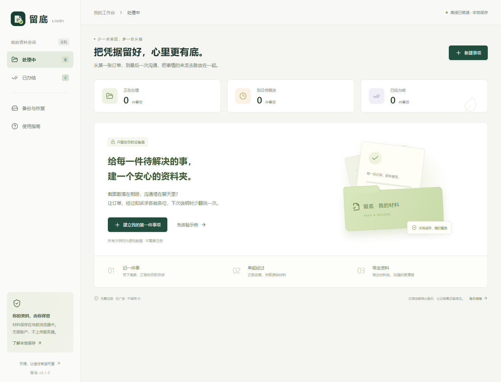

# 留底 Liudi

**把凭据留好，心里更有底。**

一个无需注册、数据保存在本机的消费售后材料夹。把订单、沟通、问题照片和处理经过串在一起，导出一份能读、能打印、能恢复的材料包。

[在线使用](https://fuzzylogic112.github.io/liudi/) · [产品设计](docs/PRODUCT.md) · [需求调研](docs/RESEARCH.md) · [参与贡献](CONTRIBUTING.md)



<details>
<summary>手机端截图</summary>



</details>

## 为什么做

遇到退货退款、维修未完成、预付服务中断时，往往要反复从相册和聊天记录中找材料，再向不同的人解释一遍。留底聚焦这件小事：**把事实整理清楚，把原始资料保管好。**

这是一个可运行的早期产品，实际使用价值仍需用户试用验证。项目研究了 [有据 YouJu](https://github.com/TwistedRiCen/youju)、[JobTracker](https://github.com/tecnologer/jobtracker) 和 [Wallos](https://github.com/ellite/Wallos)。留底选择纯静态网页、消费售后工作流和可恢复备份，独立编写代码，没有复制上述项目代码。详见 [调研依据和竞品比较](docs/RESEARCH.md)。

## 能做什么

- **建事项**：记录商家、订单、金额、诉求；按处理中 / 已办结归档、搜索。
- **记经过**：按实际发生日期记录进展，日期不详可留空；关联照片、聊天记录、PDF 等原始附件。
- **理材料**：手动勾选准备清单；保留原始字节和 SHA-256，重名文件也不会互相覆盖。
- **安排跟进**：自行设定日期，显示到日待跟进事项，导出 `.ics` 到日历应用。
- **带走资料**：复制事实摘要；导出含原附件、结构化清单和可打印报告的 ZIP。
- **恢复备份**：校验格式、大小、附件关联及摘要后，恢复为独立副本，不覆盖现有事项。
- **离线使用**：正式构建首次加载并显示“离线已就绪”后，可在断网时打开。

不需要后端、账号或模型 API。应用没有埋点、广告、远程字体和第三方运行时资源请求。访问托管网站本身仍会向托管方请求静态文件。

## 三分钟上手



1. 打开 [在线版](https://fuzzylogic112.github.io/liudi/)，选择“先体验示例”，或新建自己的事项。
2. 每次购买、联系商家、寄件或收到回复后，添加一条进展和相关材料。
3. 点击“导出材料包”，将 ZIP 保存到可靠位置。解压后打开 `report.html`，用浏览器打印即可保存为 PDF。
4. 换设备时，在新设备打开留底，通过“备份与恢复”导入 ZIP。每件事项需单独备份。

**资料保存在当前浏览器的当前网站地址下，不会自动同步。** 清理网站数据、使用无痕模式、设备损坏都可能导致丢失。不同浏览器、域名或端口会形成不同资料空间。本地数据库和导出的 ZIP **均未加密**，请使用私人设备，并在分享前检查内容。

## 本地运行

需要 Node.js 22.12+（推荐）或 20.19+，以及 npm。

```sh
git clone https://github.com/FuzzyLogic112/liudi.git
cd liudi
npm ci
npm run dev
```

构建并验证正式版离线功能：

```sh
npm run check
npm run preview
```

打开终端显示的本机地址。不要直接以 `file://` 打开 `dist/index.html`；浏览器存储、Web Crypto 和 Service Worker 需要 `localhost` 或 HTTPS。开发模式不启用离线缓存。

## 备份结构

```text
留底-事项名称.zip
├── manifest.json   # 格式版本、事项、事件、附件对应关系与 SHA-256
├── report.html     # 无脚本、无外部资源的可打印材料清单
├── README.txt      # 恢复、打印与资料保管说明
└── files/          # 使用独立标识命名的原始文件，原名保存在清单中
```

导入仅支持本项目生成的 v1 备份。解压前检查 ZIP 头与大小，拒绝路径穿越、重复条目、异常结构、加密 ZIP、ZIP64 及超限数据；校验全部完成后才执行原子写入。文件摘要用于校验字节是否一致，不提供真实性认证、可信时间戳或司法证据效力。

请保留应用导出的原始 ZIP。恢复支持应用一直使用的 STORE（不重新压缩）格式；由其他工具重新压缩的 ZIP 不受支持，避免不实的解压大小声明绕过校验。已有留底 v1 原始备份仍可恢复。

## 当前范围与限制

| 项目       | 首版行为                                               |
| ---------- | ------------------------------------------------------ |
| 附件大小   | 单个 ≤20 MiB，单次添加 ≤50 MiB                         |
| 每件事项   | 最多 200 个附件、1,000 条进展，附件合计 ≤190 MiB       |
| 文字与备份 | 事项文字 ≤1 MiB，ZIP 解压总量 ≤200 MiB                 |
| 存储       | IndexedDB；可申请浏览器持久存储，仍需主动备份          |
| 提醒       | 显示跟进日期、导出日历；没有后台推送，不计算法定期限   |
| 进展更正   | 当前可删除后重新记录；删除关联附件前请先备份           |
| 同步与加密 | 没有云同步、账户恢复、端到端加密或本地密码锁           |
| 智能处理   | 没有 OCR、AI 分析、自动取证和自动投诉                  |
| 浏览器     | 使用现代浏览器；已在 Chromium 实测，其他浏览器仍需反馈 |

## 开发与部署

React + TypeScript + Vite，IndexedDB (`idb`)，ZIP (`fflate`)，输入验证 (`zod`)，图标 (`lucide-react`)。测试使用 Vitest 和 fake-indexeddb。

```sh
npm test           # 数据持久化、并发、校验、备份恢复及异常输入
npm run build      # TypeScript 检查与静态构建
npm run check      # 全部测试与构建
```

`dist/` 可部署到支持 HTTPS 的静态站点。仓库自带 GitHub Pages 工作流：在仓库 Settings → Pages 中选择 GitHub Actions，再推送 `main` 即可构建和发布。相对资源路径支持仓库子目录。Service Worker 会缓存页面和代码，不会把附件上传到服务器；新版本通常在关闭旧页面并重新打开后生效。

代码集中在 `src/App.tsx`（交互）、`src/styles.css`（响应式界面）和 `src/lib/`（验证、持久化、材料包）。[验证记录](docs/QA.md) 说明已测试范围及限制。

## 开源与反馈

MIT License。欢迎提交不含真实个人资料的复现步骤、浏览器兼容性反馈和试用体验。不要把真实订单、联系方式、聊天记录或私密材料直接放进公开 Issue。

先验证用户是否能更快整理并恢复材料，再决定是否增加 OCR、批量备份或其他能力。当前试用计划见 [PRODUCT.md](docs/PRODUCT.md)。

### English

Liudi is a local-first, Chinese-language after-sales case organizer. Keep purchase records, communication timelines and original attachments together; export a self-contained, printable ZIP and restore it as a new case. No account, backend or AI API is required. Data stays in browser IndexedDB; backups are essential and are **not encrypted**. SHA-256 verifies file bytes, not authenticity or legal admissibility. MIT licensed.
